# Transport layer

### segement
This is done by (possibly) breaking the application messages into smaller chunks and adding a transport-layer header to each chunk to create the transport-layer segment.

### Relationship Between Transport and Network Layers

a transport-layer protocol provides logical communication between processes running on different hosts, a network-layer protocol provides logical-communication between hosts.

- a computer network may make available multiple transport protocols, with each protocol offering a different service model to applications.
- the services that a transport protocol can provide are often constrained by the service model of the underlying network-layer protocol. If the network-layer protocol cannot provide delay or bandwidth guarantees for transport-layer segments sent between hosts, then the transport-layer protocol cannot provide delay or bandwidth guarantees for application messages sent between processes.
- certain services can be offered by a transport protocol even when the underlying network protocol doesn’t offer the corresponding service at the network layer.
	- reliable data transfer.
	- encryption

### Overview of the Transport Layer in the Internet

two protocol in transport layer: UDP and TCP  
Transport layer packet: segment  
network layer protocol: IP,  IP service model is a best-effort delivery service
	- it does not guarantee segment delivery
	- it does not guarantee orderly delivery of segments
	- it does not guarantee the integrity of the data in the segments
each host has an IP address

UDP and TCP is to extend IP’s delivery service between two end systems to a delivery service between two processes running on the end systems. Extending host-to-host delivery to process-to-process delivery is called transport-layer **multiplexing** and **demultiplexing**.

**UDP** process-to-process data delivery and error checking—are the only two services that UDP provides

**TCP** 
- reliable data transfer
- congestion control 

### Multiplexing and Demultiplexing

This job of delivering the data in a transport-layer segment to the correct socket is called **demultiplexing**
The job of gathering data chunks at the source host from different sockets, encapsulating each data chunk with header information (that will later be used in demultiplexing) to create segments, and passing the segments to the network layer is called **multiplexing**

transport-layer multiplexing requires (1) that sockets have unique identifiers, and (2) that each segment have special fields that indicate the socket to which the segment is to be delivered. These special fields, illustrated in Figure 3.3, are the **source port number field** and the **destination port number field**. Each port number is a 16-bit number, ranging from 0 to 65535. The port numbers ranging from 0 to 1023 are called **well-known port numbers** and are restricted, which means that they are reserved for use by well-known

#### Connectionless Multiplexing and Demultiplexing

It is important to note that a UDP socket is fully identified by a two-tuple consisting of a destination IP address and a destination port numbe

### Connection-Oriented Multiplexing and Demultiplexing

One subtle difference between a TCP socket and a UDP socket is that a TCP socket is identified by a four-tuple: (source IP address, source port number, destination IP address, destination port number)

## Connectionless Transport: UDP

UDP takes messages from the application process, attaches source and destination port number fields for the multiplexing/demultiplexing service, adds two other small fields, and passes the resulting segment to the network layer.

- **Finer application-level control over what data is sent, and when**. UDP will package the data inside a UDP segment and immediately pass the segment to the network layer. TCP has a congestion-control mechanism that throttles the transport-layer TCP sender when one or more links between the source and destination hosts become excessively congested. TCP will also continue to resend a segment until the receipt of the segment has been acknowledged by the destination, regardless of how long reliable delivery takes. Since real-time applications often require a minimum sending rate, do not want to overly delay segment transmission, and can tolerate some data loss, TCP’s service model is not particularly well matched to these applications’ needs.
- **No connection establishment** UDP does not introduce any delay to establish a connection unlike the tcp that needs build connection before sending data. 
- **No connection state**.TCP maintains connection state in the end systems. This connection state includes receive and send buffers, congestion-control parameters, and sequence and acknowledgment number parameters. We will see in Section 3.5 that this state information is needed to implement TCP’s reliable data transfer service and to provide congestion control. UDP, on the other hand, does not maintain connection state and does not track any of these parameters. For this reason, a server devoted to a particular application can typically support many more active clients when the application runs over UDP rather than TCP.
- **Small packet header overhead** The TCP segment has 20 bytes of header overhead in every segment, whereas UDP has only 8 bytes of overhead.
### UDP Segment Structure
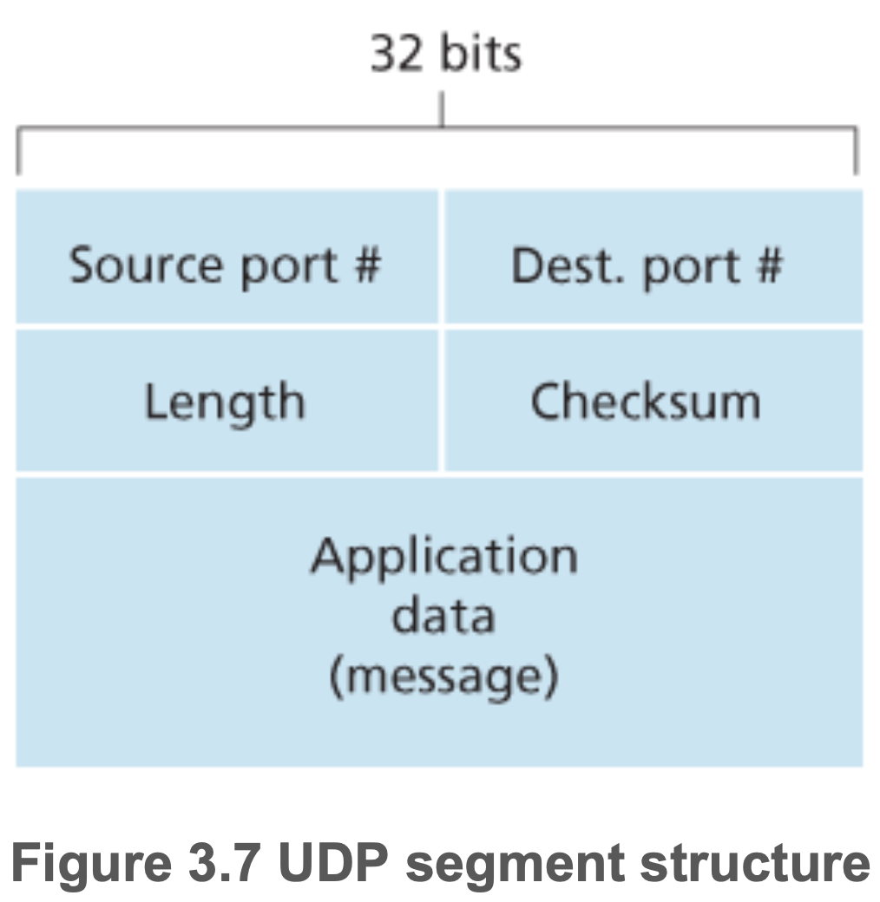

The UDP header has only four fields, each consisting of two bytes. The length field specifies the number of bytes in the UDP segment (header plus data). The checksum is used by the receiving host to check whether errors have been introduced into the segment.

### UDP Checksum

The UDP checksum provides for error detection. That is, the checksum is used to determine whether bits within the UDP segment have been altered (for example, by noise in the links or while stored in a router) as it moved from source to destination.

UDP at the sender side performs the 1s complement of the sum of all the 16-bit words in the segment, with any overflow encountered during the sum being wrapped around. At the receiver, all four 16-bit words are added, including the checksum. If no errors are introduced into the packet, then clearly the sum at the receiver will be 1111111111111111.

**wrap around**: overflow carries on the left are added back on the right.

## Principles of Reliable Data transfer
One assumption we’ll adopt throughout our discussion here is that packets will be delivered in the order in which they were sent, with some packets possibly being lost; that is, the underlying channel will not reorder packets.

The sending side of the data transfer protocol will be invoked from above by a call to **rdt_send()**.(reliable data transfer)  

On the receiving side, **rdt_rcv()** will be called when a packet arrives from the receiving side of the channel.  

When the rdt protocol wants to deliver data to the upper layer, it will do so by calling **deliver_data()**  

Both the send and receive sides of rdt send packets to the other side by a call to **udt_send()** (where udt stands for unreliable data transfer).

### Building a Reliable Data Transfer Protocol

#### Reliable Data Transfer over a Perfectly Reliable Channel: **rdt 1.0**

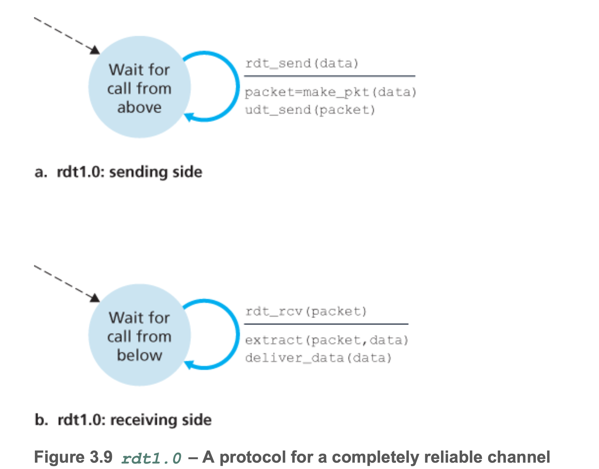

In this simple protocol, there is no difference between a unit of data and a packet. Also, all packet flow is from the sender to receiver; with a perfectly reliable channel there is no need for the receiver side to provide any feedback to the sender since nothing can go wrong! Note that we have also assumed that the receiver is able to receive data as fast as the sender happens to send data. Thus, there is no need for the receiver to ask the sender to slow down!

#### Reliable Data Transfer over a Channel with Bit Errors: **rdt2.0**

We’ll continue to assume for the moment that all transmitted packets are received (although their bits may be corrupted) in the order in which they were sent.

This message-dictation protocol uses both **positive acknowledgments** (“OK”) and **negative acknowledgments** (“Please repeat that.”). These control messages allow the receiver to let the sender know what has been received correctly, and what has been received in error and thus requires repeating. In a computer network setting, reliable data transfer protocols based on such retransmission are known as **ARQ (Automatic Repeat reQuest) protocols**.

Fundamentally, three additional protocol capabilities are required in ARQ protocols to handle the presence of bit errors
- **Error detection**: require that extra bits are sent from the sender to the receiver. 
- **Receiver feedback**:  The positive (ACK) and negative (NAK) acknowledgment replies in the message-dictation scenario are examples of such feedback. Our rdt2.0 protocol will similarly send ACK and NAK packets back from the receiver to the sender. In principle, these packets need only be one bit long; for example, a 0 value could indicate a NAK and a value of 1 could indicate an ACK.
- **Retransmission**: A packet that is received in error at the receiver will be retransmitted by the sender.

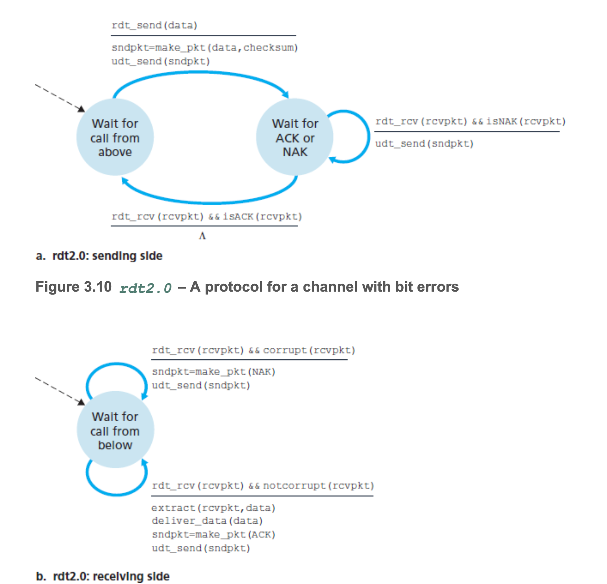

It is important to note that when the sender is in the wait-for-ACK-or-NAK state, it cannot get more data from the upper layer; that is, the rdt_send() event can not occur; that will happen only after the sender receives an ACK and leaves this state. Thus, the sender will not send a new piece of data until it is sure that the receiver has correctly received the current packet. Because of this behavior, protocols such as rdt2.0 are known as **stop-and-wait** protocols.

what if the ACK or NAK corrupts? A third approach is for the sender simply to resend the current data packet when it receives a garbled ACK or NAK packet. This approach, however, introduces duplicate packets into the sender-to-receiver channel. The fundamental difficulty with duplicate packets is that the receiver doesn’t know whether the ACK or NAK it last sent was received correctly at the sender. Thus, it cannot know a priori whether an arriving packet contains new data or is a retransmission. 

A simple solution to this new problem (and one adopted in almost all existing data transfer protocols, including TCP) is to add a new field to the data packet and have the sender number its data packets by putting a **sequence number** into this field.

**rdt2.1**  
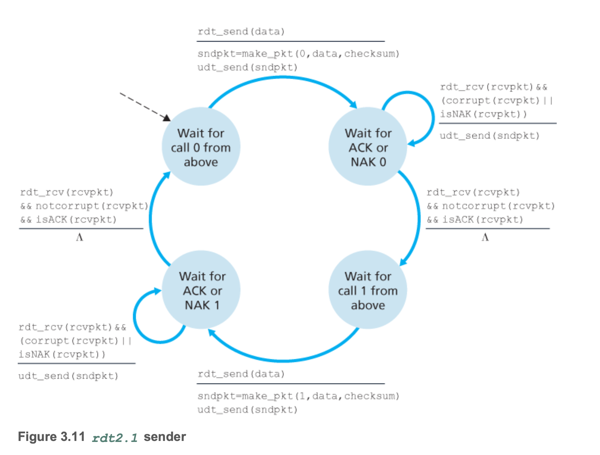
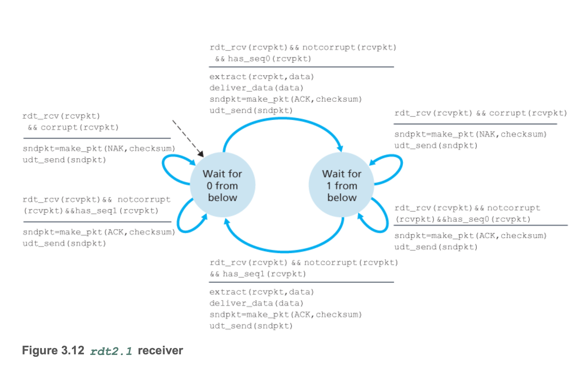

**rdt2.2**

We can accomplish the same effect as a NAK if, instead of sending a NAK, we send an ACK for the last correctly received packet. A sender that receives two ACKs for the same packet (that is, receives duplicate ACKs) knows that the receiver did not correctly receive the packet following the packet that is being ACKed twice. Our NAK-free reliable
data transfer protocol for a channel with bit errors is rdt2.2, shown in Figures 3.13 and 3.14.

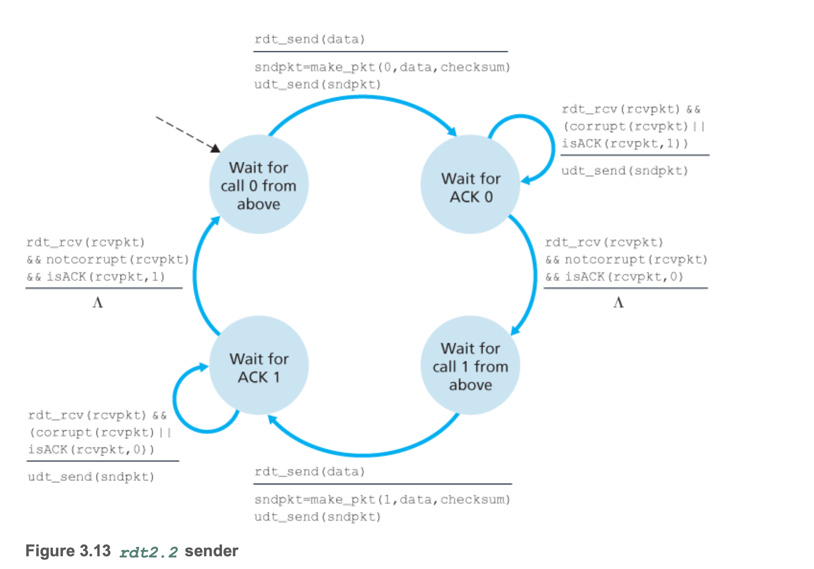
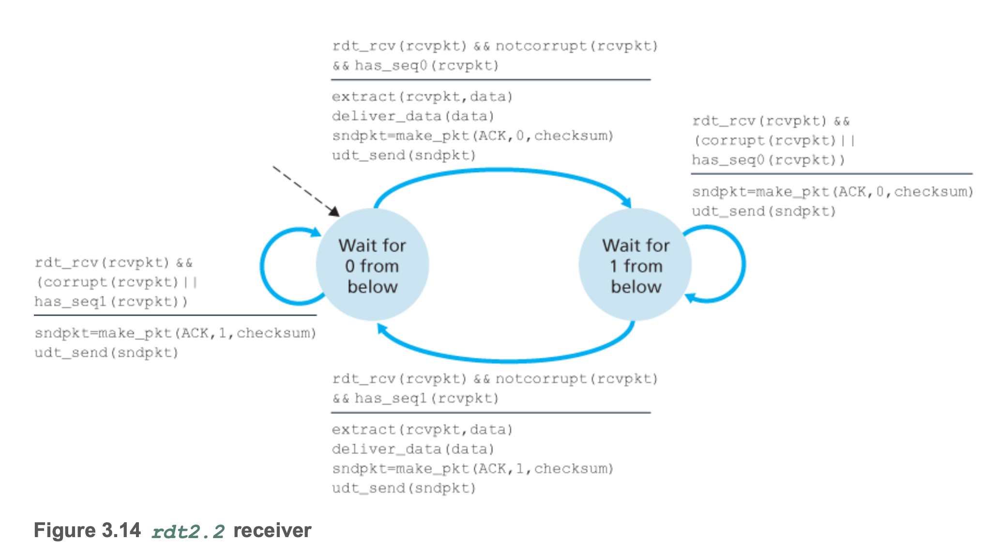

#### Reliable Data Transfer over a Lossy Channel with Bit Errors: **rdt3.0**

Suppose now that in addition to corrupting bits, the underlying channel can lose packets as well, a not- uncommon event in today’s computer networks (including the Internet).

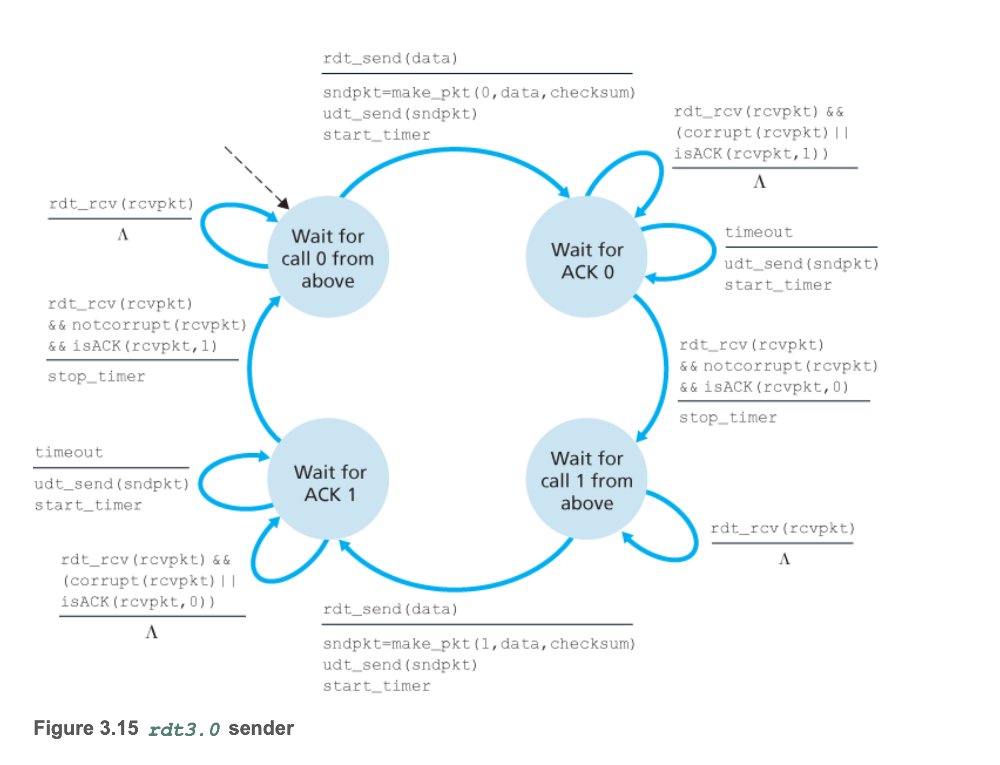

Performance problem

The solution to this particular performance problem is simple: Rather than operate in a stop-and-wait manner, the sender is allowed to send multiple packets without waiting for acknowledgments, as
illustrated in Figure 3.17(b). Figure 3.18(b) shows that if the sender is allowed to transmit three packets before having to wait for acknowledgments, the utilization of the sender is essentially tripled. Since the
many in-transit sender-to-receiver packets can be visualized as filling a pipeline, this technique is known as **pipelining**. Pipelining has the following consequences for reliable data transfer protocols:

- The range of sequence numbers must be increased, since each in-transit packet (not counting retransmissions) must have a unique sequence number and there may be multiple, in-transit,unacknowledged packets.
- The sender and receiver sides of the protocols may have to buffer more than one packet. Minimally, the sender will have to buffer packets that have been transmitted but not yet acknowledged.Buffering of correctly received packets may also be needed at the receiver, as discussed below.
- The range of sequence numbers needed and the buffering requirements will depend on the manner in which a data transfer protocol responds to lost, corrupted, and overly delayed packets. Two basic
approaches toward pipelined error recovery can be identified: **Go-Back-N** and **selective repeat**.

#### Go-Back-N (GBN)

In a Go-Back-N (GBN) protocol, the sender is allowed to transmit multiple packets (when available) without waiting for an acknowledgment, but is constrained to have no more than some maximum allowable number, N, of unacknowledged packets in the pipeline. We describe the GBN protocol in some detail in this section.

As suggested by Figure 3.19, the range of permissible sequence numbers for transmitted but not yet
acknowledged packets can be viewed as a window of size N over the range of sequence numbers. As the protocol operates, this window slides forward over the sequence number space. For this reason, N is often referred to as the window size and the GBN protocol itself as a sliding-window protocol. You might be wondering why we would even limit the number of outstanding, unacknowledged packets to a value of N in the first place. Why not allow an unlimited number of such packets? We’ll see in Section 3.5 that flow control is one reason to impose a limit on the sender. We’ll examine another reason to do so in Section 3.7, when we study TCP congestion control.

In practice, a packet’s sequence number is carried in a fixed-length field in the packet header. If k is the number of bits in the packet sequence number field, the range of sequence numbers is thus [0,2k−1]. With a finite range of sequence numbers, all arithmetic involving sequence numbers must then be done using modulo 2 arithmetic. (That is, the sequence number space can be thought of as a ring of size 2 ,where sequence number 2k−1 is immediately followed by sequence number 0.) Recall that rdt3.0 had a 1-bit sequence number and a range of sequence numbers of [0,1]. Several of the problems at the end of this chapter explore the consequences of a finite range of sequence numbers. We will see in Section 3.5 that TCP has a 32-bit sequence number field, where TCP sequence numbers count bytes in the byte stream rather than packets.

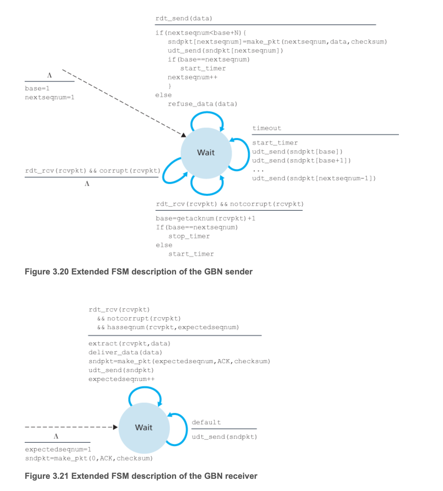

**Figures 3.20** and **3.21** give an extended FSM description of the sender and receiver sides of an ACK- based, NAK-free, GBN protocol. 

The GBN sender must respond to three types of events:

- **Invocation from above.** When rdt_send() is called from above, the sender first checks to see if
the window is full, that is, whether there are N outstanding, unacknowledged packets. If the window is not full, a packet is created and sent, and variables are appropriately updated. If the window is full,the sender simply returns the data back to the upper layer, an implicit indication that the window is full. The upper layer would presumably then have to try again later. In a real implementation, the sender would more likely have either buffered (but not immediately sent) this data, or would have a synchronization mechanism (for example, a semaphore or a flag) that would allow the upper layer to call rdt_send() only when the window is not full.
- **Receipt of an ACK**. In our GBN protocol, an acknowledgment for a packet with sequence number n will be taken to be a cumulative acknowledgment, indicating that all packets with a sequence number up to and including n have been correctly received at the receiver. We’ll come back to this issue shortly when we examine the receiver side of GBN.

- **A timeout event**. The protocol’s name, “Go-Back-N,” is derived from the sender’s behavior in the presence of lost or overly delayed packets. As in the stop-and-wait protocol, a timer will again be used to recover from lost data or acknowledgment packets. If a timeout occurs, the sender resends all packets that have been previously sent but that have not yet been acknowledged. Our sender in Figure 3.20 uses only a single timer, which can be thought of as a timer for the oldest transmitted but not yet acknowledged packet. If an ACK is received but there are still additional transmitted but
not yet acknowledged packets, the timer is restarted. If there are no outstanding, unacknowledged packets, the timer is stopped.

In our GBN protocol, the receiver discards out-of-order packets. Although it may seem silly and wasteful to discard a correctly received (but out-of-order) packet, there is some justification for doing so. Recall
that the receiver must deliver data in order to the upper layer. Suppose now that packet n is expected, but packet n+1 arrives. Because data must be delivered in order, the receiver could buffer (save) packet n+1 and then deliver this packet to the upper layer after it had later received and delivered packet n. However, if packet n is lost, both it and packet n+1 will eventually be retransmitted as a result of the GBN retransmission rule at the sender. Thus, the receiver can simply discard packet n+1. The advantage of this approach is the simplicity of receiver buffering—the receiver need not buffer any out- of-order packets. Thus, while the sender must maintain the upper and lower bounds of its window and
the position of nextseqnum within this window, the only piece of information the receiver need maintain is the sequence number of the next in-order packet. This value is held in the variable expectedseqnum, shown in the receiver FSM in Figure 3.21. Of course, the disadvantage of throwing away a correctly received packet is that the subsequent retransmission of that packet might be lost or garbled and thus even more retransmissions would be required.

#### Selective Repeat (SR)

**The problem of GBN**: performance problems. In particular, when the window size and bandwidth-delay product are both large, many packets can be in the pipeline. A single packet error can thus cause GBN to retransmit a large number of packets, many unnecessarily.

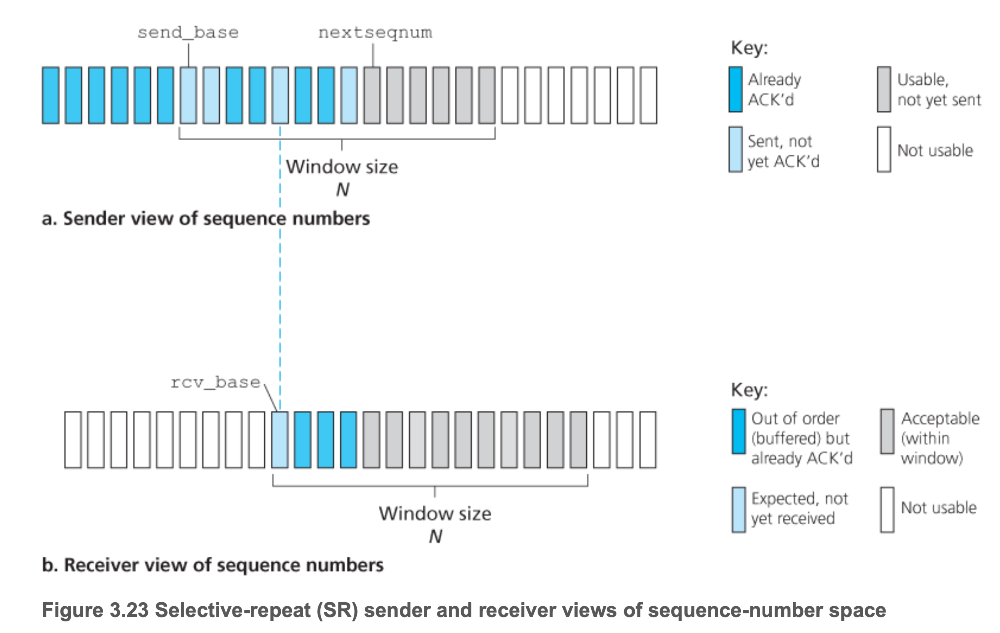

SR sender envents and actions:

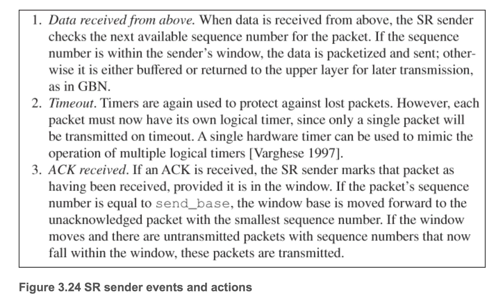

SR receiver events and actions:

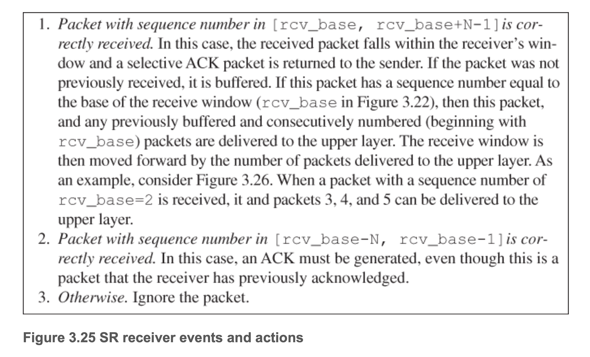

### summarize

the window size must be less than or equal to half the size of the sequence number space for SR protocols.

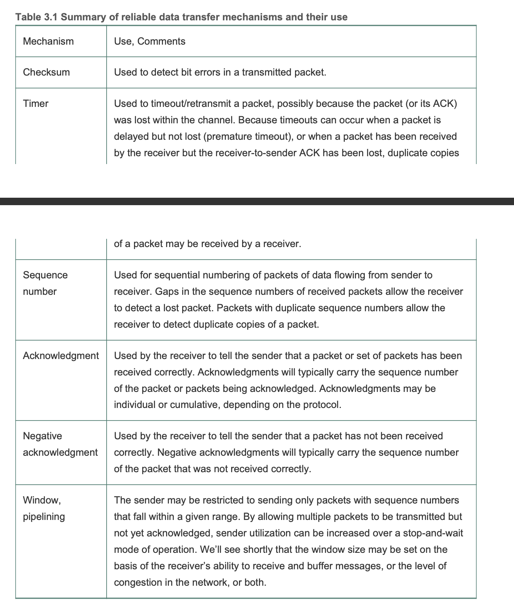

## Connection-Oriented Transport: TCP

The maximum amount of data that can be grabbed and placed in a segment is limited by the **maximum segment size (MSS)**. The MSS is typically set by first determining the length of the largest link-layer frame that can be sent by the local sending host (the so-called **maximum transmission unit**, **MTU**), and then setting the MSS to ensure that a TCP segment (when encapsulated in an IP datagram) plus the TCP/IP header length (typically 40 bytes) will fit into a single link-layer frame. Both Ethernet and PPP link-layer protocols have an MTU of 1,500 bytes. Thus a typical value of MSS is 1460 bytes.
When TCP receives a segment at the other end, the segment’s data is placed in the TCP connection’s receive buffer, as shown in Figure 3.28. The application reads the stream of data from this buffer. Each side of the connection has its own send buffer and its own receive buffer.

We see from this discussion that a TCP connection consists of buffers, variables, and a socket connection to a process in one host, and another set of buffers, variables, and a socket connection to a process in another host. As mentioned earlier, no buffers or variables are allocated to the connection in the network elements (routers, switches, and repeaters) between the hosts

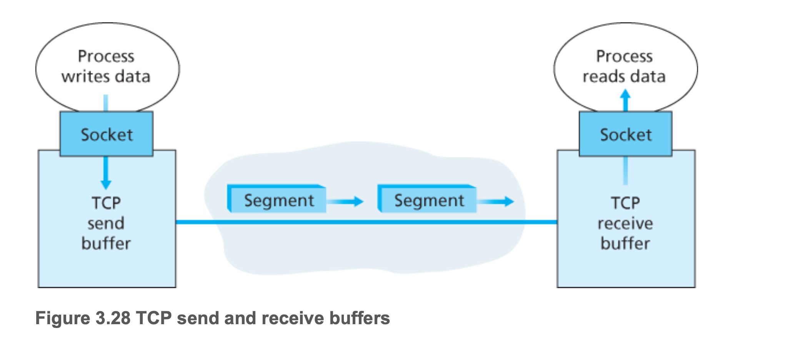

### TCP Segment Structure

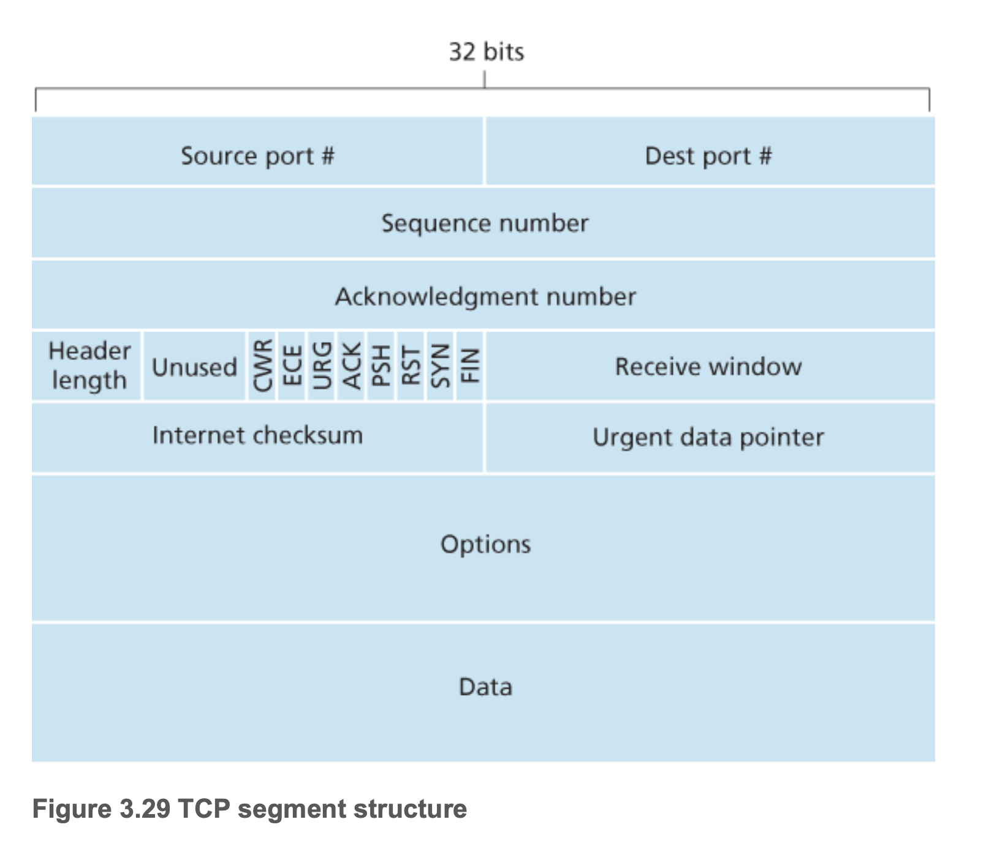

The 32-bit **sequence number field** and the 32-bit **acknowledgment number field** are used by the TCP sender and receiver in implementing a reliable data transfer service, as discussed below.

The 16-bit **receive window** field is used for flow control. We will see shortly that it is used to indicate the number of bytes that a receiver is willing to accept.

The 4-bit **header length field** specifies the length of the TCP header in 32-bit words. The TCP header can be of variable length due to the TCP options field. (Typically, the options field is empty,
so that the length of the typical TCP header is 20 bytes.).

The optional and variable-length **options field** is used when a sender and receiver negotiate the maximum segment size (MSS) or as a window scaling factor for use in high-speed networks. A time-stamping option is also defined. See RFC 854 and RFC 1323 for additional details.

The **flag field** contains 6 bits. The **ACK bit** is used to indicate that the value carried in the acknowledgment field is valid; that is, the segment contains an acknowledgment for a segment that has been successfully received. The **RST,SYN, **and **FIN** bits are used for connection setup and teardown. The **CWR** and **ECE** bits are used in explicit congestion notification. Setting the **PSH** bit indicates that the receiver should pass the data to the upper layer immediately. Finally, the **URG** bit is used to indicate that there is data in this segment that the
sending-side upper-layer entity has marked as “urgent.” The location of the last byte of this urgent data is indicated by the 16-bit **urgent data pointer** field.

#### sequence number
The **sequence number** for a segment is the byte-stream number of the first byte in the segment
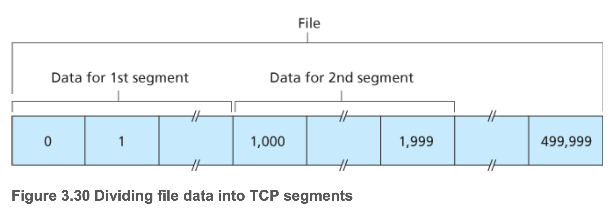

the **sequence number** is 0, 1000, 2000....

#### acknowledgment numbers

Now let’s consider acknowledgment numbers. These are a little trickier than sequence numbers. Recall that TCP is full-duplex, so that Host A may be receiving data from Host B while it sends data to Host B (as part of the same TCP connection). Each of the segments that arrive from Host B has a sequence number for the data flowing from B to A. The acknowledgment number that Host A puts in its segment is the sequence number of the next byte Host A is expecting from Host B. It is good to look at a few examples to understand what is going on here. Suppose that Host A has received all bytes numbered 0 through 535 from B and suppose that it is about to send a segment to Host B. Host A is waiting for byte 536 and all the subsequent bytes in Host B’s data stream. So Host A puts 536 in the acknowledgment number field of the segment it sends to B. As another example, suppose that Host A has received one segment from Host B containing bytes 0 through 535 and another segment containing bytes 900 through 1,000. For some reason Host A has not yet received bytes 536 through 899. In this example, Host A is still waiting for byte 536 (and beyond) in order to re-create B’s data stream. Thus, A’s next segment to B will contain 536 in the acknowledgment number field. Because TCP only acknowledges bytes up to the first missing byte in the stream, TCP is said to provide **cumulative acknowledgments**.  

This last example also brings up an important but subtle issue. Host A received the third segment (bytes 900 through 1,000) before receiving the second segment (bytes 536 through 899). Thus, the third segment arrived out of order. The subtle issue is: What does a host do when it receives out-of-order segments in a TCP connection? Interestingly, the TCP RFCs do not impose any rules here and leave the decision up to the programmers implementing a TCP implementation. There are basically two choices: either (1) the receiver immediately discards out-of-order segments (which, as we discussed earlier, can simplify receiver design), or (2) the receiver keeps the out-of-order bytes and waits for the missing bytes to fill in the gaps. Clearly, the latter choice is more efficient in terms of network bandwidth, and is the approach taken in practice.

In Figure 3.30, we assumed that the initial sequence number was zero. In truth, both sides of a TCP connection randomly choose an initial sequence number. This is done to minimize the possibility that a
segment that is still present in the network from an earlier, already-terminated connection between two hosts is mistaken for a valid segment in a later connection between these same two hosts (which also
happen to be using the same port numbers as the old connection)

#### Round-Trip Time Estimation and Timeout

**SampleRTT**: the amount of time between when the segment is sent (that is, passed to IP) and when an acknowledgment for the segment is received. Instead of measuring a SampleRTT for every transmitted segment, most TCP implementations take only one **SampleRTT** measurement at a time. That is, at any point in time, the **SampleRTT** is being estimated for only one of the transmitted but currently unacknowledged segments, leading to a new value of **SampleRTT** approximately once every **RTT**

TCP maintains an average, called **EstimatedRTT**, of the SampleRTT values.

**EstimatedRTT=(1−α)⋅EstimatedRTT+α⋅SampleRTT**

**DevRTT**, as an estimate of how much SampleRTT typically deviates from **EstimatedRTT**

**DevRTT=(1−β)⋅DevRTT+β⋅|SampleRTT−EstimatedRTT|** (The recommended value of β is 0.25)

TCP provides reliable data transfer by using positive acknowledgments and timers in much the
same way that we studied in Section 3.4.

Given values of EstimatedRTT and DevRTT, what value should be used for TCP’s timeout interval?
- Clearly, the interval should be greater than or equal to EstimatedRTT, or unnecessary retransmissions would be sent. But the timeout interval should not be too much larger than EstimatedRTT; otherwise, when a segment is lost, TCP would not quickly retransmit the segment, leading to large data transfer delays. It is therefore desirable to set the timeout equal to the EstimatedRTT plus some margin. The margin should be large when there is a lot of fluctuation in the **SampleRTT** values; it should be small when there is little fluctuation. The value of **DevRTT** should thus come into play here. All of these considerations are taken into account in TCP’s method for determining the retransmission timeout interval:
	**TimeoutInterval=EstimatedRTT+4⋅DevRTT**
An initial TimeoutInterval value of 1 second is recommended [RFC 6298]. Also, when a timeout occurs, the value of TimeoutInterval is doubled to avoid a premature timeout occurring for a subsequent segment that will soon be acknowledged. However, as soon as a segment is received and EstimatedRTT is updated, the TimeoutInterval is again computed using the formula above.

### Reliable Data Transfer
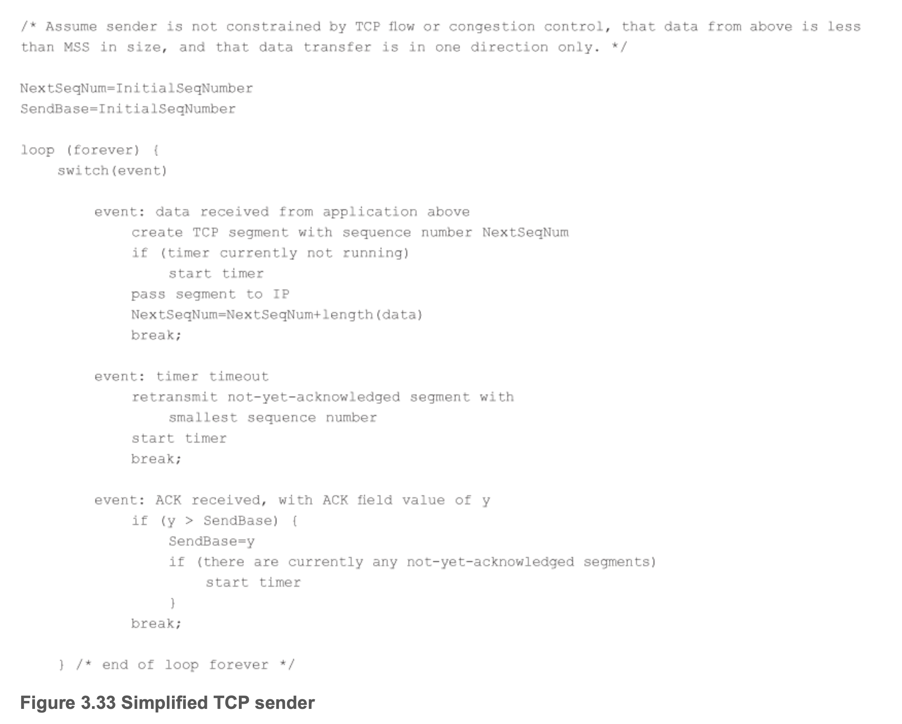

It is helpful to think of the timer as being associated with the oldest unacknowledged segment.The expiration interval for this timer is the **TimeoutInterval**, which is calculated from **EstimatedRTT** and **DevRTT**.

**Doubling the Timeout Interval.** each time TCP retransmits, it sets the next timeout interval to twice the previous value,rather than deriving it from the last **EstimatedRTT** and **DevRTT**. However, whenever the timer is started after either of the two other events (that is, data received from application above, and ACK received), the TimeoutInterval is derived from the most recent values of EstimatedRTT and DevRTT. This mechanism provides a limited form of congestion control. 

**Fast Retransmit**

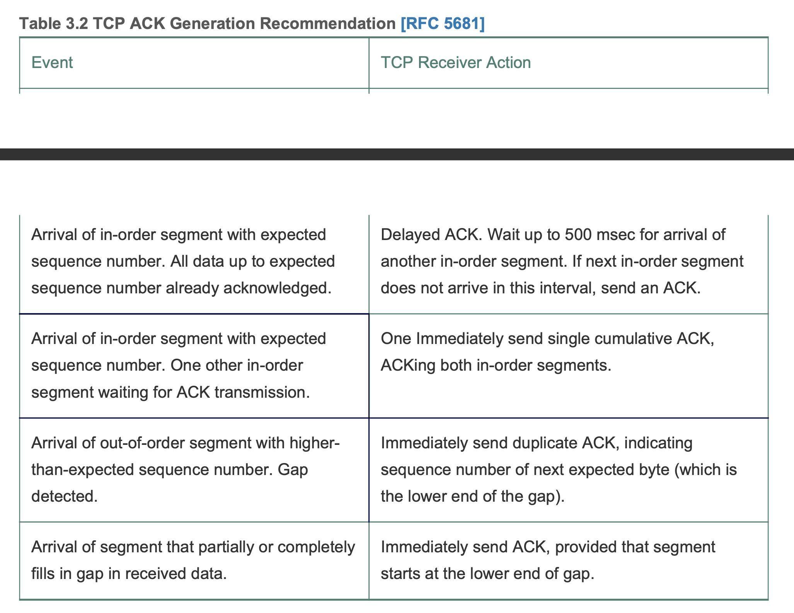
	event: ACK received, with ACK field value of y  
			if (y > SendBase) {  
				SendBase=y  
				if (there are currently any not yet acknowledged segments)  
               		start timer  
            } else {/* a duplicate ACK for already ACKed  
		       segment */  
		   		increment number of duplicate ACKs received for y  
			if (number of duplicate ACKS received for y==3)  
		       /* TCP fast retransmit */  
		       resend segment with sequence number y  
		   }  
		break;  

